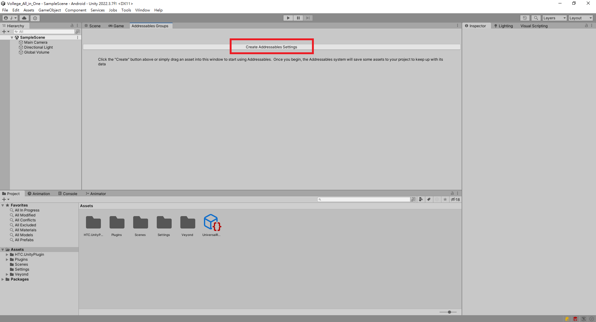

# General_Architecture
這是簡易的Game Flow架構，包含StartUp、Verification、Lobby三個基礎場景。

## Requirement
* Unity： 2022.3 up
## Plugin
* Zenject： 是一個輕量級的高性能依賴注入框架，專門針對Unity構建。可以編寫鬆散耦合且高度職責分離的程式碼。
* Vive Input 是一套能讓使用者方便管理Vive設備(包含Vive Trackers)的unity套件，且可跨平台。
* Addressable： 它提供了一種以"address"載入資產的簡易方式，他透過簡化打包資源包與部署來降低開發的開銷。
## Installation  
  
你可以使用以下方法安裝General_Architecture
1.  __從[Releases Page](https://github.com/modesttree/Zenject/releases)__ 在這裡您可以選擇以下選項：
* **General_Architecture_v1.0.0.unitypackage** - 這相當於您在資源商店中找到的內容，所有包含General_Architecture的原始代碼都在這裡。

## UseCase
該簡易的架構需要手動匯入Addressable與XR Plugin Management

* Addressable：
1. 打開UPM工具，並安裝。
**看到Bug不用緊張，套件沒有安裝導致的。**
2. 打開**Addressables Groups**，並點選**Create Addressables Settings**。
3. 右鍵點選**Create New Group > Packed Assets**。
4. 重新命名為**Scenes**，並將**Verification**、**Lobby**兩個場景拖曳上來後分別更名為**Scenes/Verification**、**Scenes/Lobby**。

* XR Plugin Management：  
1.打開Build Setting並確定切換至Android平台後按下Player Settings。  
2.選取XR Plugin Management後點選Install XR Plugin Management。  
3.再來就看需要開發到哪些裝置並安裝該裝置的SDK。
